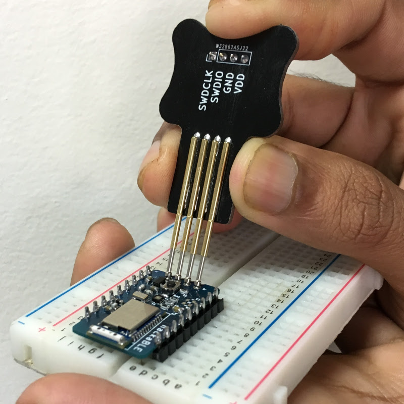

## PogoProg Model B Pogo Pin Programmer

Pogo Pin Programmer with 2.54 mm pitch - perfect for SWD programming.

Most microcontrollers support the SWD protocol as a convenient method to program and debug the chip. If you are making a custom PCB for a product or project, it's a good idea to add an SWD programming header to the board. PogoProg Model B is designed for use with such a 4-pin 2.54mm header that uses the *SWDIO*, *SWDCLK*, *VDD* and *GND* pins. (Of course you can use this programmer for any 4 signal lines, as long as the pitch is compatible.)

We design a lot of custom hardware and it's a common practise to add an SWD header to a PCB. We've been making do with make-shift programmers for a while now. We finally decided that it would be a good idea to make a well-designed product that would be helpful to the maker community at large.

We've taken care to design PogoPin with ergonomics and aesthetics in mind. Pogo pins are expensive and inconvenient to source in small quantities, so we believe that providing a pre-soldered inexpensive programmer could be beneficial.
